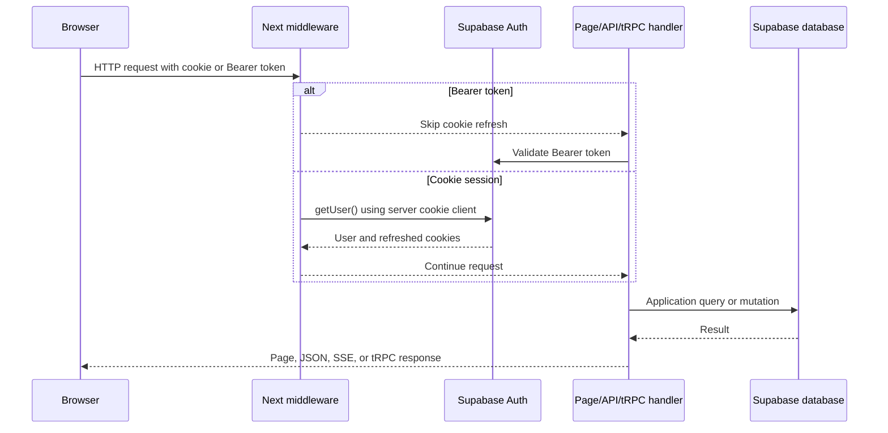
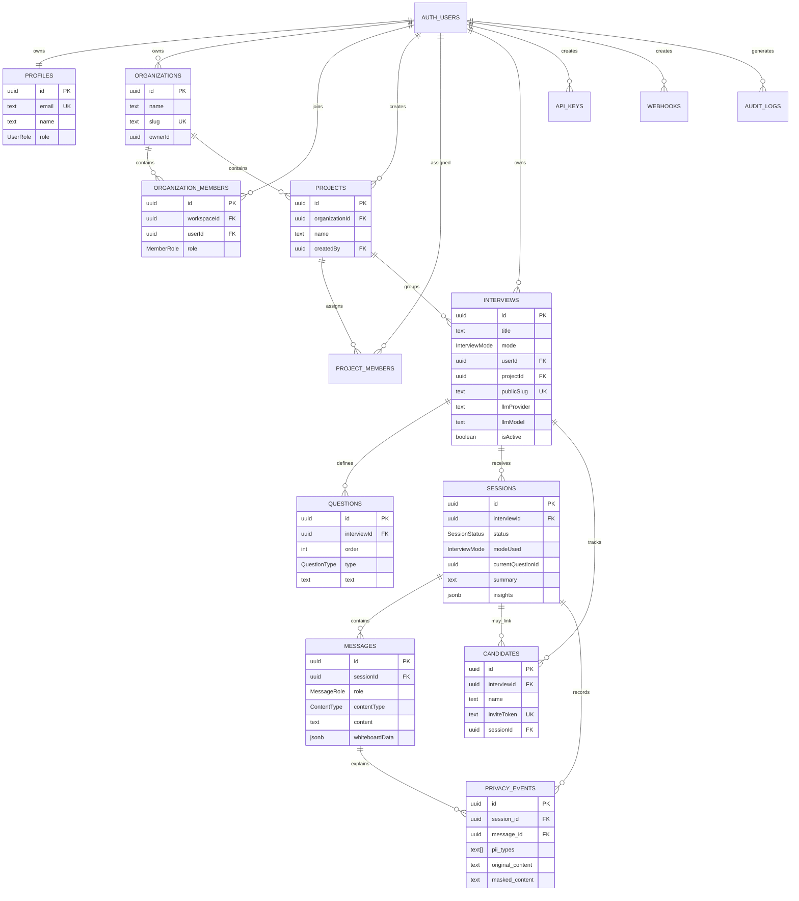
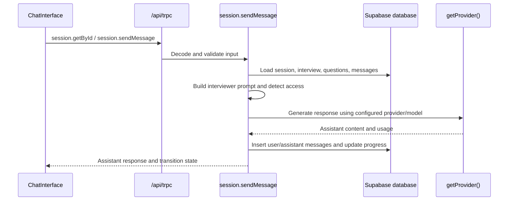
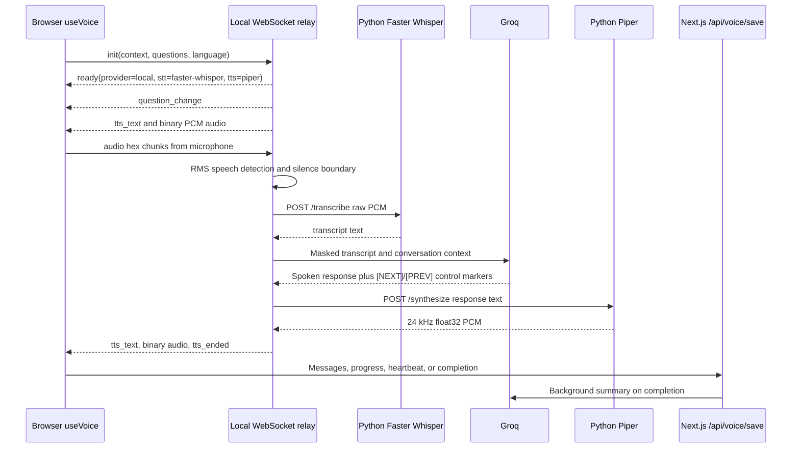
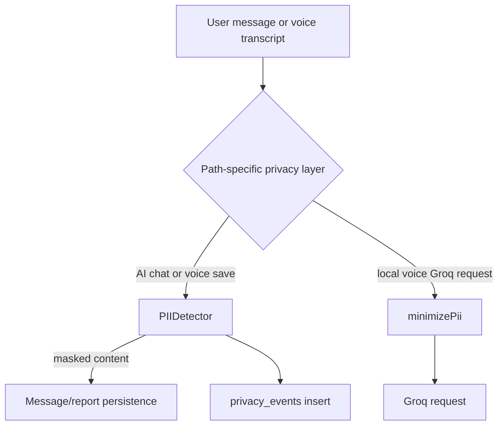
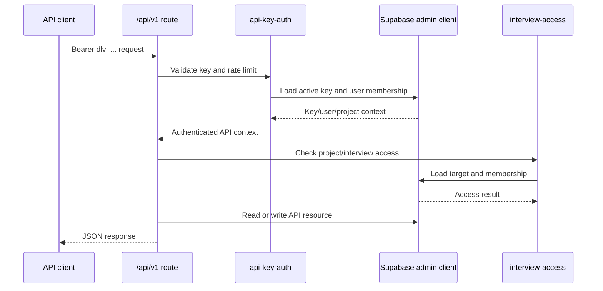
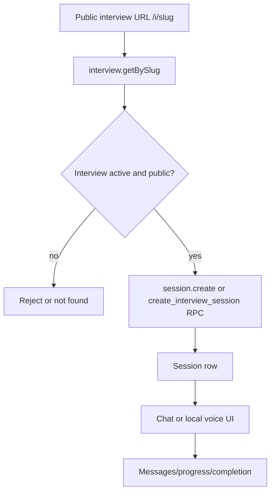
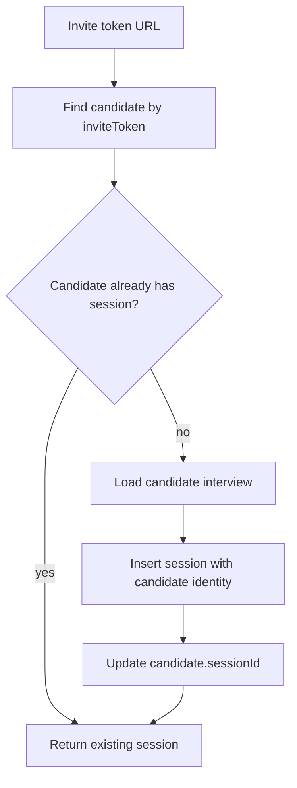
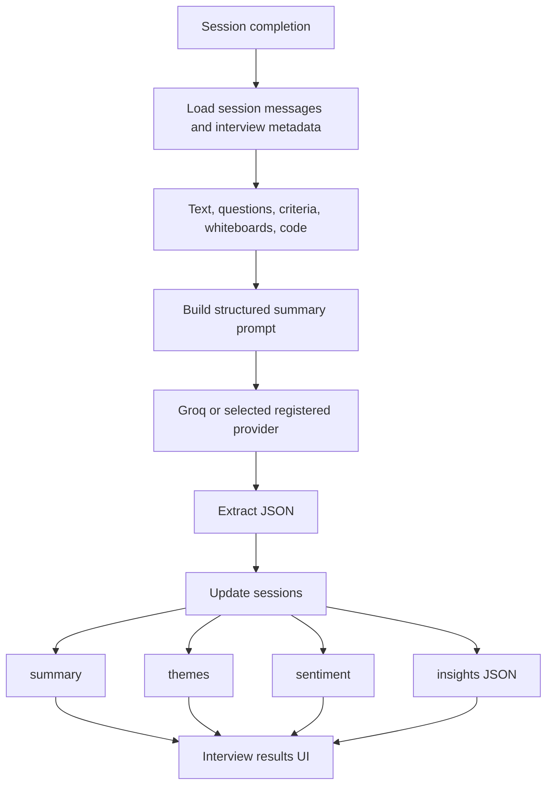

# Bheem Project Information

This document describes the Bheem repository as implemented by the checked-in source code and SQL files. It is intended to be a technical source-of-truth for architecture, runtime processes, HTTP and tRPC interfaces, data movement, database structure, AI pipelines, voice processing, storage, security boundaries, and verification status.

The documentation deliberately distinguishes:

- **Implemented:** directly observable in source or SQL.
- **Configured:** represented by a checked-in configuration or environment variable.
- **Environment-dependent:** requires local services, credentials, models, or external network access and was not proven by static inspection alone.
- **Conflict:** two checked-in setup paths do not describe the same behavior.

No secret values are reproduced here.

---

## 1. Product Scope

Bheem is a Next.js application for creating and running structured AI interviews. The repository supports:

- Authenticated interview authoring and administration.
- Organizations, organization members, projects, and project members.
- Interview templates and custom interview questions.
- Chat interviews.
- Voice interviews through a local WebSocket relay and local speech sidecar.
- Optional camera, screen, audio recording, screenshots, whiteboards, and code-editor responses.
- Candidate records and invite-token sessions.
- AI-assisted interview generation, refinement, chat, resume parsing, and post-interview reporting.
- A versioned API-key REST API under `/api/v1`.
- A tRPC API under `/api/trpc` for the web application.
- Supabase Auth, PostgreSQL, Storage, and Realtime configuration.

The active hosted text model path in the current source is Groq. The Groq and xAI providers use the `openai` npm package as an OpenAI-compatible HTTP client; this does not mean requests are sent to OpenAI. The removed standalone OpenAI provider and OpenAI voice relay are not part of the current source implementation.

---

## 2. Repository Layout

```text
.
├── models/piper/
│   ├── en_US-lessac-medium.onnx
│   └── en_US-lessac-medium.onnx.json
├── python/
│   ├── local_voice_service.py
│   └── requirements-local-voice.txt
├── server/
│   ├── dev-supervisor.ts
│   └── local-voice-relay.ts
├── src/
│   ├── app/                 Next.js App Router pages and HTTP handlers
│   ├── components/          React UI, session, interview, auth, docs, and UI components
│   ├── content/docs/        In-app documentation content
│   ├── hooks/               Browser workflows such as voice and recording
│   ├── lib/                 Shared auth, AI, privacy, Supabase, voice, scoring, and utilities
│   └── server/              tRPC context, RBAC helpers, and routers
├── supabase/
│   ├── migrations/          Ordered database migrations
│   ├── create_all.sql       Separate bootstrap SQL path
│   ├── fix_*.sql             Manual repair scripts
│   ├── setup_check.sql      Manual schema health check
│   ├── config.toml          Local Supabase configuration
│   └── templates/            Local Auth email templates
├── tests/                   Node and Playwright tests
├── public/images/           Marketing, documentation, and blog assets
├── package.json             Scripts and dependencies
├── next.config.mjs          Next.js configuration
├── tailwind.config.ts      Tailwind configuration
├── tsconfig.json            TypeScript configuration
└── components.json          UI component configuration
```

Important generated or local directories:

- `.next/` is a Next.js build/development output directory.
- `node_modules/` contains installed JavaScript dependencies.
- `tsconfig.tsbuildinfo` is TypeScript incremental-build state.
- The Python speech models and dependencies are external runtime prerequisites even though the Piper model files are present in the repository.

---

## 3. Runtime Processes

### 3.1 Next.js application

The Next.js application is started by:

```text
npm run dev:next
```

or by the supervisor used by:

```text
npm run dev
```

The app exposes App Router pages and route handlers. The configured local Supabase URL and browser Supabase URL are separate environment concerns: server code uses `SUPABASE_URL` and `SUPABASE_ANON_KEY`, while browser code uses `NEXT_PUBLIC_SUPABASE_URL` and `NEXT_PUBLIC_SUPABASE_ANON_KEY`.

### 3.2 Development supervisor

`server/dev-supervisor.ts`:

1. Loads `.env.local` with override enabled.
2. Loads `.env` afterward.
3. Starts Next using `node_modules/next/dist/bin/next dev`.
4. Starts `server/local-voice-relay.ts` using `tsx`.
5. Prefixes child stdout/stderr with the child name.
6. Terminates child processes when the supervisor receives `SIGINT` or `SIGTERM`.
7. Shuts down when a child exits with a non-zero code.

The supervisor does not start the Python speech service directly. The local voice relay starts that child process when `LOCAL_VOICE_AUTO_START` is not `false`.

### 3.3 Local WebSocket voice relay

`server/local-voice-relay.ts` creates a WebSocket server on:

```text
VOICE_RELAY_PORT, default 8081
```

It communicates with the browser over WebSocket and with the Python sidecar over HTTP. Its text-generation request goes to Groq using:

```text
GROQ_API_KEY
GROQ_BASE_URL, default https://api.groq.com/openai/v1
GROQ_MODEL, default openai/gpt-oss-20b
```

The relay does not use the browser's tRPC chat endpoint for voice turns.

### 3.4 Python speech sidecar

`python/local_voice_service.py` creates a localhost-only HTTP server:

```text
LOCAL_VOICE_HOST, default 127.0.0.1
LOCAL_VOICE_PORT, default 8090
```

It exposes:

| Method | Path | Behavior |
|---|---|---|
| GET | `/health` | Returns health, Whisper model name, and whether Piper is configured. |
| POST | `/transcribe` | Accepts raw 16-bit mono PCM at 16 kHz and returns JSON text. |
| POST | `/synthesize` | Accepts JSON text and returns float32 PCM audio as an octet stream. |

The sidecar loads:

- Faster Whisper using `WHISPER_MODEL`, `WHISPER_DEVICE`, and `WHISPER_COMPUTE_TYPE`.
- Piper using `PIPER_MODEL_EN`.
- The repository contains the English Piper model under `models/piper/`, but the environment variable must point to it for loading to succeed.

### 3.5 Runtime topology

```mermaid
flowchart LR
    Browser[Browser React application]
    Next[Next.js server]
    TRPC[/api/trpc]
    HTTP[Next.js route handlers]
    Relay[Local WebSocket voice relay]
    Speech[Python speech sidecar]
    Groq[Groq OpenAI-compatible API]
    Supabase[Supabase local or hosted services]
    Storage[Supabase Storage]

    Browser --> Next
    Browser --> TRPC
    Browser --> HTTP
    Browser --> Relay
    Next --> TRPC
    TRPC --> Supabase
    HTTP --> Supabase
    HTTP --> Storage
    Relay --> Speech
    Relay --> Groq
    HTTP --> Groq
    Speech --> Piper[Piper TTS model]
    Speech --> Whisper[Faster Whisper model]
```

The browser-to-relay connection is independent of the Next.js HTTP request path. The relay owns the live voice turn loop; Next.js owns persistence and most authenticated application operations.

---

## 4. Start, Build, Test, and Database Commands

Defined in `package.json`:

| Command | Implemented behavior |
|---|---|
| `npm run dev` | Runs `server/dev-supervisor.ts`; starts Next development mode and the local voice relay. |
| `npm run dev:next` | Runs `next dev`. |
| `npm run dev:voice:local` | Runs the local voice relay only. |
| `npm run build` | Runs `next build`. |
| `npm run start` | Runs `next start`. |
| `npm run lint` | Runs `next lint`. |
| `npm run test:web` | Runs the listed Node test files for auth, rate limiting, templates, playback, privacy, lifecycle, scoring, and voice save behavior. |
| `npm run test:functional` | Runs `tests/functional.test.ts` serially. |
| `npm run db:types` | Runs Supabase type generation against the local database and writes `src/lib/supabase/types.ts`. |

The checked-in Supabase configuration uses these local ports:

| Service | Port in `supabase/config.toml` |
|---|---:|
| Supabase API | 54321 |
| PostgreSQL | 54322 |
| Supabase Studio | 54323 |
| Local email testing UI | 54324 |
| Shadow database | 54320 |
| Disabled pooler | 54329 configuration |

`supabase/config.toml` enables API, database migrations, seed processing, Realtime, Studio, local SMTP testing, Storage, and Storage S3 protocol support. The repository does not contain the configured `supabase/seed.sql` listed in that file, so seed behavior depends on whether that file exists outside the checked-in tree.

---

## 5. Application Composition

`src/app/layout.tsx` is the root layout. It sets metadata, viewport configuration, favicon references, canonical URL, Open Graph metadata, Twitter metadata, and wraps the application with `Providers` plus the toast system.

`src/components/providers.tsx` composes the browser providers in this order:

```text
TRPC provider
  └── TanStack Query provider
      └── AuthProvider
          └── AppLocaleProvider
              └── OrgProvider
                  └── ProjectProvider
                      └── next-themes ThemeProvider
                          └── application pages
```

`src/middleware.ts` runs on requests except static/image/favicon paths. It:

1. Skips cookie refresh when the request already contains a Bearer token.
2. Creates a Supabase server client from request cookies.
3. Calls `supabase.auth.getUser()` to refresh/validate the session.
4. Copies refreshed cookies to the response.
5. Deletes stale `sb-*` cookies when no authenticated user is found.

The middleware does not itself enforce that every page is authenticated. Individual pages, procedures, and handlers perform their own access checks.

---

## 6. Authentication and Authorization

### 6.1 Auth sources

The server supports two authentication forms:

- Supabase cookie sessions for the web application.
- `Authorization: Bearer <token>` for mobile/API-style requests.

`src/lib/auth.ts` first attempts cookie authentication using the server Supabase client. If that fails, it checks the request Authorization header and validates the token through the Supabase admin client.

`src/server/context.ts` follows the same cookie-then-Bearer pattern for tRPC requests. The context exposes:

```text
user       resolved Supabase user or null
supabase   supabaseAdmin service-role client
```

### 6.2 tRPC procedure protection

`protectedProcedure` rejects requests without `ctx.user`. `publicProcedure` does not require an authenticated user. Router-level authorization then applies organization, project, interview, and role checks where implemented.

The RBAC role hierarchy is:

```text
VIEWER < MEMBER < ADMIN < OWNER
```

The helper functions in `src/server/trpc.ts` provide:

- Minimum-role checks.
- Organization membership lookup.
- Project access checks.
- Effective project role resolution.
- Filtering of accessible project IDs.

If a project has no rows in `project_members`, the application helper treats all organization members as having project access. Once project-member rows exist, access is limited to listed users.

### 6.3 Auth flow



### 6.4 Signup side effects

The canonical migration defines `public.handle_new_user()` as an `AFTER INSERT` trigger on `auth.users`. It:

1. Creates or updates a `profiles` row.
2. Creates a personal organization with slug `personal-<user id>` if needed.
3. Creates an `OWNER` organization membership.
4. Creates a `Default` project.

The trigger is defined in `supabase/migrations/001_initial_schema.sql` and also represented in `supabase/create_all.sql`.

---

## 7. Next.js Pages and API Surface

### 7.1 Page groups

The App Router contains these page areas:

- Marketing/home: `/`.
- Authentication: `/login`, `/register`.
- Dashboard: `/dashboard`.
- Interview authoring: `/interviews`, `/interviews/new`, `/interviews/[id]/edit`, settings, sessions, and results pages.
- Candidates and questions: `/candidates`, `/questions`.
- Projects and organizations: `/projects`, `/projects/[id]`, `/organizations`, `/org/*`.
- Account and settings: `/account`, `/settings`, `/usage`.
- Public interviews: `/i/[slug]` and `/i/[slug]/session`.
- Invite interviews: `/i/invite/[token]` and `/i/invite/[token]/session`.
- Documentation: `/docs`, `/docs/[category]`, `/docs/[category]/[slug]`.
- Functional voice test page: `/functional-tests/voice`.

### 7.2 HTTP route handlers

| Route | Method | Implemented purpose | Authentication in handler |
|---|---|---|---|
| `/api/health` | GET | Probes configured database tables and returns health information. | None in handler. |
| `/api/trpc/[trpc]` | GET/POST | tRPC transport for the registered application router. | Per tRPC context/procedure. |
| `/api/ai/chat` | POST | Loads an interview, masks detected PII in messages, calls a selected provider, stores assistant output, and advances the question. | No explicit auth check in the route. |
| `/api/ai/generate` | POST | Generates an interview definition as an SSE stream. | Authenticated user required. |
| `/api/ai/refine` | POST | Streams an improved interview definition. | Authenticated user required. |
| `/api/ai/summarize` | POST | Generates and stores a post-interview report. | Authenticated user and interview ownership check. |
| `/api/ai/parse-resume` | POST | Extracts PDF text locally and streams structured candidate data from Groq. | Authenticated user required. |
| `/api/ai/extract-text` | POST | Extracts text from uploaded PDFs or HTTP(S) documents. | Authenticated user required. |
| `/api/auth/change-password` | POST | Changes the authenticated Supabase password. | Authenticated user required. |
| `/api/auth/delete-account` | POST | Deletes selected owned records and then the Supabase Auth user. | Authenticated user required. |
| `/api/session/upload` | POST | Uploads a recording or screenshot to Supabase Storage and returns a one-year signed URL. | No explicit auth check in handler. |
| `/api/session/complete` | POST | Completes a session as a safety-net endpoint. | No explicit auth check in handler. |
| `/api/session/leave` | POST | Updates activity segments when a participant leaves. | No explicit auth check in handler. |
| `/api/voice/save` | POST | Saves voice messages/progress/heartbeat, completes sessions, and starts background summary generation. | No explicit auth check in handler. |
| `/api/voice/token` | POST | Returns interview metadata used by voice entry flows. | No explicit auth check in handler. |
| `/api/download/recording` | GET | Proxies a requested recording URL. | No explicit auth check in handler. |
| `/api/support` | POST | Creates a support ticket and uploads user-scoped attachments. | Authenticated user required. |
| `/api/v1/interviews` | GET/POST | API-key list/create interviews. | `dlv_` API key. |
| `/api/v1/interviews/[id]` | GET/PATCH/DELETE | API-key interview read/update/delete. | `dlv_` API key and project access. |
| `/api/v1/interviews/[id]/publish` | POST | Publishes an interview through the API. | `dlv_` API key and access checks. |
| `/api/v1/interviews/[id]/questions` | GET/POST | Lists or creates interview questions. | `dlv_` API key and access checks. |
| `/api/v1/questions/[id]` | PATCH/DELETE | Updates or deletes a question. | `dlv_` API key and access checks. |
| `/api/v1/interviews/[id]/sessions` | GET | Lists sessions for an interview. | `dlv_` API key and access checks. |
| `/api/v1/sessions/[id]` | GET | Reads a session and related data. | `dlv_` API key and access checks. |
| `/api/v1/interviews/[id]/candidates` | GET/POST | Lists or creates candidates. | `dlv_` API key and access checks. |
| `/api/v1/usage` | GET | Returns usage information. | `dlv_` API key. |
| `/api/v1/openapi.json` | GET | Returns the checked-in OpenAPI description generated by the route file. | No explicit auth in route. |

The public/session endpoints use service-role database access in their route implementations. Their protection therefore depends on validation in the handler, public slugs/invite tokens, unguessable IDs, and deployment configuration. The checked-in code does not give all of those endpoints a caller-authentication requirement.

### 7.3 tRPC transport

The browser creates a tRPC client with `httpBatchLink` to `/api/trpc`. The server adapter is `src/app/api/trpc/[trpc]/route.ts`, and the route dispatches `appRouter` from `src/server/routers/_app.ts`.

---

## 8. Registered tRPC Procedures

The following routers are registered in `src/server/routers/_app.ts`.

| Router | Procedures |
|---|---|
| `auth` | No registered procedures. |
| `analysis` | `getSessionSummary`, `getInterviewInsights` |
| `apiKey` | `list`, `create`, `revoke`, `delete` |
| `candidate` | `create`, `bulkCreate`, `list`, `update`, `remove`, `removeMany`, `listAll`, `getByToken` |
| `interview` | `list`, `getById`, `getBySlug`, `create`, `createFromTemplate`, `update`, `delete`, `deleteMany`, `publish`, `unpublish`, `duplicate`, `stats`, `dashboardStats` |
| `organization` | `orgLimit`, `list`, `getById`, `create`, `update`, `delete` |
| `orgMember` | `list`, `invite`, `updateRole`, `remove`, `listProjectRoles`, `updateProjectRole`, `addProjectMember`, `removeProjectMember`, `leave` |
| `project` | `list`, `getById`, `create`, `update`, `delete` |
| `question` | `create`, `update`, `delete`, `reorder`, `listAll` |
| `session` | `create`, `createPreview`, `createFromInvite`, `getById`, `sendMessage`, `saveWhiteboard`, `deleteWhiteboard`, `saveCode`, `deleteCode`, `updateCurrentQuestion`, `complete`, `reportAntiCheatingViolation`, `listAll`, `listByInterview`, `saveRecording`, `deleteMany` |
| `usage` | `summary`, `tokenTransactions`, `sessionTransactions`, `templateTransactions` |
| `user` | `updateName` |
| `webhook` | `list`, `create`, `update`, `delete` |

`src/server/routers/workspace.ts` contains a separate `workspace` router with `list`, `create`, `addMember`, and `removeMember`, but it is not included in `appRouter` and therefore is not exposed by the registered tRPC API.

---

## 9. Core Interview Data Model

The canonical relational model is centered on `interviews`, `questions`, `sessions`, `messages`, and `candidates`. Organization and project tables provide ownership and access context.



### 9.1 Canonical enum types

`supabase/migrations/001_initial_schema.sql` defines:

| Enum | Values |
|---|---|
| `UserRole` | `USER`, `ADMIN`, `ENTERPRISE` |
| `MemberRole` | `OWNER`, `ADMIN`, `MEMBER`, `VIEWER` |
| `InterviewMode` | `CHAT`, `VOICE`, `HYBRID` |
| `ToneLevel` | `CASUAL`, `PROFESSIONAL`, `FORMAL`, `FRIENDLY` |
| `FollowUpDepth` | `LIGHT`, `MODERATE`, `DEEP` |
| `QuestionType` | `OPEN_ENDED`, `SINGLE_CHOICE`, `MULTIPLE_CHOICE`, `CODING`, `WHITEBOARD`, `RESEARCH` |
| `SessionStatus` | `IN_PROGRESS`, `COMPLETED`, `ABANDONED` |
| `MessageRole` | `USER`, `ASSISTANT`, `SYSTEM` |
| `ContentType` | `TEXT`, `AUDIO`, `FILE`, `IMAGE`, `WHITEBOARD`, `CODE` |

### 9.2 Session extensions

Migrations add:

- `sessions.activitySegments` in migration `002_activity_segments.sql`.
- `sessions.audioRecordings` in migration `003_audio_recordings.sql`.
- `privacy_events` in migration `007_privacy_events.sql`.

The session duration code uses `activitySegments` when available. Older sessions can use a message-timestamp fallback that caps each idle gap at five minutes. An in-progress session's effective current time is capped at ten minutes after its last activity to prevent abandoned sessions from accumulating unlimited duration.

---

## 10. Database Initialization Paths

### 10.1 Ordered migrations

The checked-in migration sequence is:

```text
001_initial_schema.sql
002_activity_segments.sql
003_audio_recordings.sql
007_privacy_events.sql
```

Migration 001 is described in the SQL header as a squashed initial schema. It defines the core tables, enum types, RLS policies, storage buckets/policies, timestamp trigger, signup trigger, public/invite session functions, organization creation function, and helper membership function.

### 10.2 `create_all.sql` conflict

`supabase/create_all.sql` is a separate idempotent-style bootstrap script. It does not reproduce the canonical migration exactly. Verified differences include:

- It does not create `support_tickets`.
- It does not create the storage buckets or storage policies required by the upload routes.
- It does not define `create_interview_session`, `create_invite_session`, or `create_organization`.
- It includes `activitySegments` and `audioRecordings` directly in `sessions`.
- It uses substantially broader RLS policies, including `USING (true)` or `WITH CHECK (true)` for several project, question, session, candidate, and message operations.
- It defines a reduced set of table policies compared with migration 001.

The repository therefore has two database setup descriptions with different schema and authorization behavior. The actual database state depends on which setup path was executed.

### 10.3 Manual SQL scripts

| File | Function |
|---|---|
| `supabase/fix_org.sql` | Creates a personal organization, owner membership, profile, and default project for the first user without an organization. |
| `supabase/fix_session_function.sql` | Creates or replaces `create_interview_session`, grants it to `authenticated` and `anon`, and verifies its existence. |
| `supabase/setup_check.sql` | Checks required table presence, interview columns, the signup trigger, and `handle_new_user`. |

---

## 11. Database Functions and Triggers

### `update_updated_at`

A trigger function that sets `NEW."updatedAt" = now()`. Migration 001 attaches it to profiles, organizations, projects, interviews, questions, sessions, candidates, and webhooks.

### `handle_new_user`

An Auth trigger function described in Section 6.4.

### `create_interview_session`

A `SECURITY DEFINER` function that accepts an interview ID, participant fields, mode, and current question ID. It only inserts a session when the interview has a non-null `publicSlug` and `isActive = true`.

### `create_invite_session`

A `SECURITY DEFINER` function that:

1. Finds a candidate by `inviteToken`.
2. Returns the existing linked session if the candidate already has one.
3. Loads the candidate's interview.
4. Creates a session using candidate data.
5. Links the new session back to the candidate.

### `create_organization`

A `SECURITY DEFINER` function that requires `auth.uid()`, creates an organization, creates the owner membership, creates a Default project, and returns organization identity fields.

### `is_org_member`

A stable `SECURITY DEFINER` SQL function used by organization RLS policies to test membership.

---

## 12. Row-Level Security and Storage

### 12.1 Canonical migration RLS intent

Migration 001 enables RLS on the core tables and applies policies intended to provide these boundaries:

- Profiles, API keys, webhooks, audit logs, and support tickets are user-scoped.
- Organization reads include owners and members.
- Organization membership management is owner-controlled.
- Projects are organization-member readable and organization-admin managed.
- Project members are readable by organization members and manageable by organization admins.
- Interviews are owner-controlled, with active public interviews readable through `publicSlug`.
- Questions are readable to interview owners and active public interviews; mutations are owner-controlled.
- Sessions are readable by interview owners; public sessions may be created for active public interviews; session update policy is broad.
- Messages are readable by interview owners and may be inserted into active sessions.
- Candidates are readable by interview owners or through an invite token and are otherwise owner-controlled.

### 12.2 Storage buckets

Migration 001 creates private buckets:

```text
whiteboards
recordings
screenshots
support-attachments
```

The application uses service-role storage operations in upload handlers. The SQL also contains authenticated storage policies. Support attachment policies require the first path folder to equal the authenticated user ID.

### 12.3 Privacy-event RLS

Migration 007 enables RLS on `privacy_events` but creates:

```sql
FOR SELECT USING (true)
FOR INSERT WITH CHECK (true)
```

This is a verified property of the checked-in migration and is broader than a user/session-scoped policy.

---

## 13. Chat Interview Pipeline

The primary browser chat implementation is `src/components/session/chat-interface.tsx`. It uses the tRPC session procedures rather than the separate `/api/ai/chat` route.



The separate `/api/ai/chat` handler also exists. Its implementation:

1. Loads an interview and questions.
2. Calls `getProvider(interview.llmProvider)`.
3. Masks detected PII in the supplied conversation history.
4. Builds the interviewer prompt.
5. Generates an assistant response.
6. Removes control tokens.
7. Inserts an assistant message.
8. Advances the current question when the response contains the transition marker.

Static inspection shows the primary `ChatInterface` path uses tRPC; the standalone handler is a separate route and is not the documented primary browser chat transport.

---

## 14. Voice Interview Pipeline

### 14.1 Browser-to-relay flow



### 14.2 Browser capture and playback

`src/hooks/use-voice.ts`:

- Requests microphone access.
- Captures microphone audio as 16-bit PCM at 16 kHz.
- Encodes each PCM chunk as hexadecimal JSON data for the WebSocket.
- Receives JSON events and binary Float32 PCM.
- Uses `AudioContext` at 24 kHz for playback.
- Uses the playback jitter-buffer helpers to avoid underruns.
- Tracks transcript, assistant output, question transitions, completion, and saving state.
- Sends recorded chat/voice messages and progress to the voice-save endpoint.

### 14.3 Relay speech boundaries

`server/local-voice-relay.ts`:

- Uses an RMS threshold of `900` to identify speech energy.
- Buffers audio once speech starts.
- Ends a turn after 700 ms of silence or 15 seconds of utterance duration.
- Requires at least 250 ms of PCM before flushing.
- Sends audio to the Python `/transcribe` endpoint.
- Masks common PII using `minimizePii` before Groq generation.
- Handles explicit skip, previous, and end intents.
- Interprets `[NEXT]` and `[PREV]` markers returned by Groq.
- Sends question changes and transition events to the browser.

The relay forces the language used in `askGroq` to `English` in the current implementation, even though the interview context contains a language field. This is an implemented behavior, not an assumption.

### 14.4 Local speech sidecar

The Python sidecar:

- Writes received PCM to a temporary WAV file.
- Runs Faster Whisper with VAD settings.
- Deletes the temporary file afterward.
- Loads Piper lazily on the first synthesis request.
- Synthesizes WAV audio.
- Resamples to 24 kHz when the source voice uses another sample rate.
- Converts signed 16-bit samples to little-endian float32 bytes.

### 14.5 Voice persistence and completion

`/api/voice/save` delegates to `handleVoiceSave` in `src/app/api/voice/save/logic.ts`.

| Input condition | Behavior |
|---|---|
| Missing `sessionId` | Returns HTTP 400. |
| `messages` present | Detects/masks PII, writes message rows, and emits privacy events when PII is detected. |
| `complete = true` | Loads the session, calculates duration, marks the session completed, and starts summary generation without blocking the response. |
| `currentQuestionIndex` present | Resolves the question and updates current question plus `lastActivityAt`. |
| Neither completion nor question index | Updates `lastActivityAt` as a heartbeat. |

Summary generation loads all session messages, extracts whiteboard and code inputs, builds a structured prompt, calls the report provider, parses JSON, and writes `summary`, `themes`, `sentiment`, and `insights` to the session.

---

## 15. Recording, Screenshots, Whiteboards, and Code

### Recording

`src/hooks/use-interview-recording.ts`:

- Captures microphone audio.
- Mixes microphone and TTS audio through an `AudioContext` where configured.
- Uses `MediaRecorder`.
- Prefers MP4/AAC or falls back to WebM/Opus depending on browser support.
- Captures camera and screen streams when enabled.
- Captures periodic screenshots.
- Uses `fix-webm-duration` for WebM output.
- Uploads recordings and screenshots through `/api/session/upload`.

### Upload path

```mermaid
flowchart LR
    UI[Voice/session UI] --> Upload[/api/session/upload]
    Upload --> Validate{type recording or screenshot?}
    Validate -->|recording| RB[(recordings bucket)]
    Validate -->|screenshot| SB[(screenshots bucket)]
    RB --> Signed[One-year signed URL]
    SB --> Signed
    Signed --> Session[(sessions.audioRecordingUrl / screenshots)]
```

The upload handler accepts multipart `file`, `sessionId`, `type`, and optional `filename`. The storage path is `<sessionId>/<filename or timestamp>`. It does not update the session row itself; callers use the returned path/URL in subsequent persistence operations.

### Whiteboard and code

The Excalidraw-based whiteboard and Monaco-based code editor are persisted through session tRPC procedures. Whiteboard and code payloads are stored in message fields such as `whiteboardData`, `whiteboardImageUrl`, `whiteboardPages`, and `contentType`.

Reports read whiteboard image data, convert SVG data URLs to PNG when needed, and include images as multimodal message parts when the active provider supports them. If the provider rejects image input with a recognized vision error, the report path retries using text-only whiteboard context.

---

## 16. AI Provider and AI Pipelines

### 16.1 Provider registry

`src/lib/ai/registry.ts` registers:

- `GroqProvider`.
- `XAIProvider`.

The default selection order is:

```text
Groq -> xAI
```

The registry also resolves an explicit provider ID or model name when the caller supplies one. The current configured models are controlled by:

```text
GROQ_GENERATOR_MODEL, default qwen/qwen3.8-27b
GROQ_REPORT_MODEL, default GROQ_GENERATOR_MODEL
XAI_GENERATOR_MODEL, default grok-3-mini
XAI_REPORT_MODEL, default XAI_GENERATOR_MODEL
REPORT_MODEL, optional explicit report override
```

The active local `.env.local` contains `GROQ_API_KEY`; provider selection therefore resolves to Groq unless an explicit model/provider choice selects another registered provider.

### 16.2 Provider transport

`GroqProvider` and `XAIProvider` both instantiate the `openai` npm client with provider-specific API keys and base URLs. Both call OpenAI-compatible `/chat/completions` endpoints. The npm client name is a transport implementation detail; the configured base URL determines the remote provider.

### 16.3 Interview generation

```mermaid
flowchart TD
    Form[AI generator UI] --> Extract[/api/ai/extract-text for source documents]
    Form --> Generate[/api/ai/generate]
    Generate --> Auth[Authenticated user check]
    Auth --> PII[Mask description, job description, resume]
    PII --> Prompt[Build generator prompt]
    Prompt --> Provider[Groq or explicit registered provider]
    Provider --> SSE[SSE text/thinking stream]
    SSE --> Parse[Extract and validate JSON]
    Parse --> Retry[Retry malformed output up to configured attempts]
    Retry --> UI[AI generator UI]
    UI --> Interview[tRPC interview/question mutations]
```

The generation route masks input PII, streams provider output, filters thinking sections, extracts JSON, and retries provider calls when the response is malformed. The resulting interview is persisted through tRPC mutations from the client component.

### 16.4 Interview refinement

`/api/ai/refine`:

1. Requires authentication.
2. Accepts an interview definition and feedback.
3. Builds an improvement prompt.
4. Streams a provider response.
5. Processes thinking tags and JSON output.
6. Retries according to the route's retry logic.

The route does not apply the same explicit input PII masking sequence as `/api/ai/generate`.

### 16.5 Resume parsing

```mermaid
flowchart LR
    PDF[Candidate PDF] --> Route[/api/ai/parse-resume]
    Route --> Auth[Authenticated user check]
    Auth --> Local[pdf-parse text extraction]
    Local --> Groq[Groq chat completion]
    Groq --> SSE[SSE token stream]
    SSE --> CandidateUI[Candidate import dialog]
    CandidateUI --> DB[tRPC candidate mutations]
```

The current route uses Groq's OpenAI-compatible client and `GROQ_RESUME_MODEL`, defaulting to `openai/gpt-oss-20b`. The `openai/` prefix is part of the Groq model name in the current code, not an indication that the request goes to OpenAI.

The route sends the extracted resume text to the configured hosted model. It does not call `PIIDetector` or `minimizePii` before that request.

### 16.6 Summary/report generation

The summary prompt contains a system instruction and always contains a user message. Text-only summaries use a user instruction requesting JSON; whiteboard summaries use a multimodal user message containing text and image parts. This user message is required by the active Groq request template.

The structured report can include:

- `summary`
- `themes`
- `sentiment`
- `keyInsights`
- `notableQuotes`
- `toneAnalysis`
- `questionEvaluations`
- `criteriaEvaluations`
- `researchFindings`

The parser extracts JSON from the provider response. The persistence layer stores the main report fields in `sessions` and places evaluation arrays under `sessions.insights`.

---

## 17. Privacy and PII Processing

There are two distinct masking utilities.

### 17.1 `PIIDetector`

`src/lib/privacy/pii-detector.ts` detects and masks supported entities at confidence threshold `0.7`. The implementation is used by the standalone AI chat route and voice-save message persistence. When detections occur, those paths insert a `privacy_events` row containing:

- Session ID.
- Detected PII types.
- Count.
- Original content.
- Masked content.
- Confidence threshold.

### 17.2 `minimizePii`

`src/lib/privacy/minimize.ts` performs pattern-based minimization for common email, phone, card-number, and URL forms. The local voice relay uses it before sending user text and conversation history to Groq. This utility does not itself create a privacy-event record.

### 17.3 Privacy flow



Privacy behavior is path-dependent. It is not a single global middleware applied to every AI request.

---

## 18. API-Key REST API

API keys are stored in `api_keys` and are handled through `src/lib/api-key-auth.ts`.

The implemented request contract is:

```text
Authorization: Bearer dlv_<key>
```

Validation checks the key prefix, active state, and expiry. Successful use updates `lastUsedAt`. The in-memory rate limiter allows 60 requests per key per minute and returns rate-limit headers on rejection.

API-key request flow:



The API access helper resolves the first organization membership for the API-key user and filters project access using project-member rows. Some API handlers perform additional resource checks.

---

## 19. Public and Invite Session Flows

### Public slug session



The database function `create_interview_session` verifies that the interview has a public slug and is active before inserting a session.

### Invite session



The database function `create_invite_session` implements this lifecycle.

---

## 20. Frontend Session Capabilities

The session UI has separate concerns:

- `ChatInterface`: text conversation and message persistence.
- `VoiceInterface`: voice state, transcripts, local relay events, and save lifecycle.
- `IntervieweeOnboarding`: microphone testing, browser speech-synthesis fallback, camera/screen checks, and participant setup.
- `WhiteboardCanvas`: Excalidraw interaction and persistence hooks.
- `CodeEditorCanvas`: Monaco editor interaction and persistence hooks.
- `useInterviewRecording`: audio/video/screen capture and uploads.
- `useAntiCheating`: visibility/blur, paste, and multiple-screen signals where browser APIs support them.
- `useVoice`: WebSocket voice transport, PCM capture, playback, transcript, transitions, and completion.

The application also includes interview authoring components for question construction, AI generation, resume imports, candidates, sharing, and results visualization.

---

## 21. Results and Report Persistence

The report lifecycle is:



Voice completion starts summary generation in a fire-and-forget promise so the participant-facing save request does not wait for the report. The standalone `/api/ai/summarize` route performs a synchronous report operation from its handler perspective.

---

## 22. Security and Data-Access Observations

These are direct observations from the checked-in code and SQL, not claims about a deployed environment:

1. The tRPC context exposes the service-role Supabase client, so application-level authorization in routers is important and database RLS is not the only enforcement boundary for tRPC operations.
2. Several public/session handlers use service-role operations without explicit user authentication in the handler: voice token, voice save, session upload, session completion, session leave, and the standalone AI chat route.
3. The recording download handler accepts a requested URL and proxies it without an explicit authentication check in the route.
4. The canonical migration and `create_all.sql` have materially different RLS policies. Applying the wrong setup path changes the database security boundary.
5. `privacy_events` policies in migration 007 permit unrestricted select and insert at the SQL policy level.
6. The TypeScript Supabase schema file is not fully aligned with the canonical migration: it still contains legacy workspace-shaped definitions and does not model every SQL table, function, or later session/privacy field.
7. The local voice relay sends minimized transcript/context data to the configured Groq endpoint.
8. Resume parsing sends extracted resume text to the configured Groq endpoint without the PII detector/minimizer used in some other paths.

These observations should be reviewed before production deployment; this document does not claim they are intentional or safe.

---

## 23. Environment Configuration

The repository's `.env.local` contains both active configuration and legacy/unused names. Values are intentionally omitted.

### Supabase and application

```text
SUPABASE_URL
SUPABASE_ANON_KEY
SUPABASE_SERVICE_ROLE_KEY
NEXT_PUBLIC_SUPABASE_URL
NEXT_PUBLIC_SUPABASE_ANON_KEY
DATABASE_URL
NEXT_PUBLIC_APP_URL
```

### Hosted text AI

```text
GROQ_API_KEY
GROQ_BASE_URL
GROQ_MODEL
GROQ_GENERATOR_MODEL
GROQ_REPORT_MODEL
GROQ_RESUME_MODEL
XAI_API_KEY
XAI_GENERATOR_MODEL
XAI_REPORT_MODEL
REPORT_MODEL
```

Only the variables referenced by current source should be treated as active. The current registry selects Groq first when `GROQ_API_KEY` is configured and falls back to xAI only when Groq is unavailable or an explicit xAI selection is used.

### Local voice

```text
VOICE_RELAY_PORT
LOCAL_VOICE_SERVICE_URL
LOCAL_VOICE_AUTO_START
LOCAL_VOICE_HOST
LOCAL_VOICE_PORT
WHISPER_MODEL
WHISPER_DEVICE
WHISPER_COMPUTE_TYPE
PIPER_MODEL_EN
STT_PROVIDER
TTS_PROVIDER
PYTHON_EXECUTABLE
```

`PYTHON_EXECUTABLE` is read by `server/local-voice-relay.ts` when starting the Python child process. `PIPER_MODEL_EN` is required by the Python service for synthesis.

### Legacy/ignored names

The current source no longer contains the removed OpenAI voice relay or remote relay configuration. If these names remain in `.env.local`, they are not used by current source paths:

```text
NEXT_PUBLIC_OPENAI_VOICE_RELAY_URL
NEXT_PUBLIC_VOICE_RELAY_PRIMARY
NEXT_PUBLIC_VOICE_RELAY_ONLY
OPENAI_VOICE_RELAY_PORT
```

A repository-wide source scan should be repeated after future changes before treating any environment variable as active.

---

## 24. Testing and Verification

### Checked-in test files

| Test file | Scope |
|---|---|
| `tests/api-key-auth.test.ts` | API-key parsing and authentication errors. |
| `tests/api-rate-limit.test.ts` | 60-per-minute behavior and response headers. |
| `tests/functional.test.ts` | Playwright login locale, mobile auth handoff, and voice completion/save ordering. |
| `tests/interview-templates.test.ts` | Interview template structure and question types. |
| `tests/playback-jitter-buffer.test.ts` | PCM timing and playback queue behavior. |
| `tests/privacy-minimize.test.ts` | Email, phone, and URL minimization. |
| `tests/session-lifecycle.test.ts` | Activity duration, stale-session grace, and message-gap duration. |
| `tests/session-score.test.ts` | Score extraction and fallback behavior. |
| `tests/voice-save-route.test.ts` | Voice messages, progress, heartbeat, completion, summary dispatch, and failures. |

### Verification status for this documentation pass

The source and SQL were inspected directly. The following checks are separate from static documentation and should be run in the target environment:

```text
npx tsc --noEmit
npm run test:web
npm run test:functional
npm run build
npx supabase start
npx supabase db reset
```

Functional tests require a working `npx`/Node process-spawn environment, Playwright/browser dependencies, and a running application. Local voice tests additionally require Python packages, Faster Whisper model availability, Piper, and a valid `PIPER_MODEL_EN` path. External Groq behavior requires a valid key, reachable endpoint, and a model enabled for the account.

Static documentation cannot prove:

- Whether a credential is valid or has been revoked.
- Whether a hosted provider accepts the configured model.
- Whether a deployed database matches migration 001 plus migrations 002, 003, and 007.
- Whether deployed RLS policies match the checked-in SQL.
- Whether Python dependencies and speech models are installed.
- Whether browser media capture is supported on a particular device.
- Whether a production reverse proxy correctly forwards WebSocket traffic.

---

## 25. Source-of-Truth References

The highest-value implementation references for future changes are:

- Runtime startup: `package.json`, `server/dev-supervisor.ts`, `server/local-voice-relay.ts`.
- Browser provider composition: `src/app/layout.tsx`, `src/components/providers.tsx`.
- Auth: `src/middleware.ts`, `src/lib/auth.ts`, `src/server/context.ts`, `src/server/trpc.ts`.
- Registered API: `src/server/routers/_app.ts`, `src/app/api/trpc/[trpc]/route.ts`.
- AI registry/providers: `src/lib/ai/registry.ts`, `src/lib/ai/providers/groq.ts`, `src/lib/ai/providers/xai.ts`.
- AI prompts: `src/lib/ai/prompts/generator.ts`, `src/lib/ai/prompts/interviewer.ts`, `src/lib/ai/prompts/summary.ts`.
- Chat: `src/components/session/chat-interface.tsx`, `src/server/routers/session.ts`, `src/app/api/ai/chat/route.ts`.
- Voice: `src/hooks/use-voice.ts`, `src/lib/voice/relay-routing.ts`, `server/local-voice-relay.ts`, `python/local_voice_service.py`.
- Voice persistence/report: `src/app/api/voice/save/route.ts`, `src/app/api/voice/save/logic.ts`.
- Database: `supabase/migrations/001_initial_schema.sql`, migrations 002/003/007, `supabase/config.toml`.
- Alternate/manual database setup: `supabase/create_all.sql`, `supabase/fix_org.sql`, `supabase/fix_session_function.sql`, `supabase/setup_check.sql`.

This file describes the current checked-in design. When code, SQL, environment names, or startup commands change, update this document in the same change so the diagrams and pipeline descriptions remain accurate.
